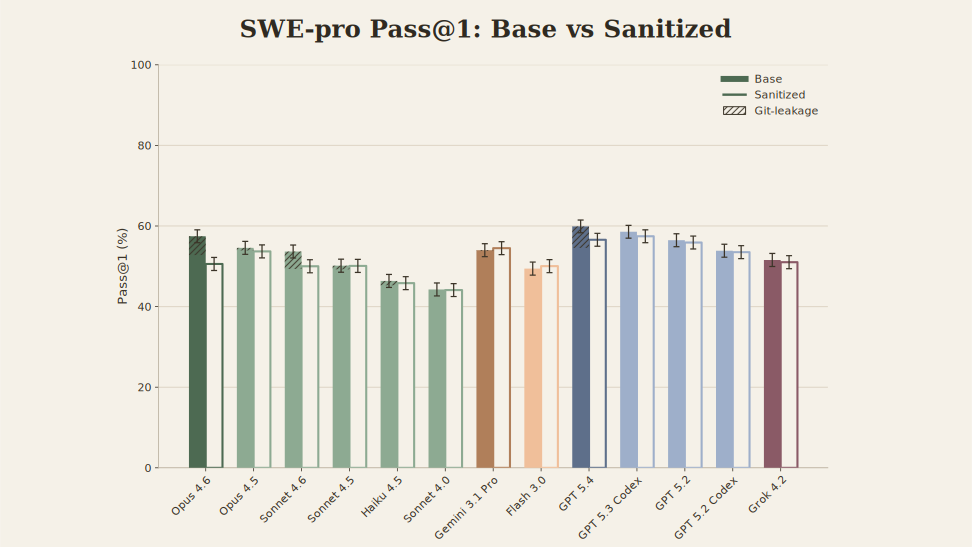

# Git Leakage in SWE-Pro

The [public SWE-Pro dataset containers](https://hub.docker.com/r/jefzda/sweap-images) check the repository out at the
instance's `base_commit` and leave `HEAD` there, but the **full git history is
still present** inside the container. Nothing stops an agent from running
`git log --all`, `git branch -a`, or `git show <future-sha>` and reading the
upstream fix straight out of the repo. While the model is never directly handed the gold-commit SHA, it sometimes probes git history for hints. Ideally, only commits earlier than the  base_commit would be reachable, but because future commits are present in the dataset container, the agent occasionally locates the gold PR itself. We call this **git leakage**.

To measure how much each model relies on it, we evaluate two variants of every
instance:

- **Base** — the official SWE-Pro dataset containers, untouched. `HEAD` is at
  `base_commit`, but every dev branch, tag, and post-`base_commit` commit is
  still reachable through `git`.
- **Sanitized** — before the agent starts, we drop all non-`main` refs, then
  strip every commit on `main` that is newer than the `base_commit`. The working tree is identical to Base except that the agent no longer has access to the commits it should not have access to.
  The exact procedure (remove remotes, delete every
  ref, recreate `main` at `HEAD`, expire reflog, GC unreachables) is in
  [`sanitize_image.sh`](sanitize_image.sh), run once inside each container.

The gap **Base − Sanitized** is the leakage-impact signal: a model that
genuinely solves the task should score the same on both splits; a model that
pulls the fix out of `git` should drop on Sanitized.

## Methodology

We define **leakage** as any situation where the gold patch ends up in the model's context before the agent concludes its trajectory. Once the gold patch is in context, the model can transcribe it; whether it does or not, we count that instance as leaked.
Detecting leakage requires inspecting every tool call the agent makes and checking whether its output reveals the upstream fix. In addition to the Base-vs-Sanitized score gap, we use a tractable direct-trace proxy of scanning each trajectory for a call of the form:


```
git show <gold-patch-sha>
```

If such a call exists in a trajectory that resolves the Base instance, the gold patch is definitely in context and the instance is marked as leaked. We compute the leakage fraction (shaded in the figure below) as the share of all 731 projects that are leaked as well as resolved in the Base container.

**Caveat — this is a lower bound.**. Leakage can also occur through non-gold future commits — a follow-up that includes the same diff, a merge commit, a release-tag commit, or even `git log -p` dumping the fix without an explicit `git show`. We do not account for those paths, so the true leakage share is likely higher.



Per-model Pass@1 on SWE-Pro under both regimes. The shaded region is the
fraction of all 731 projects that the model resolves in the Base container and
whose trajectory contains the direct leakage pattern described above.
